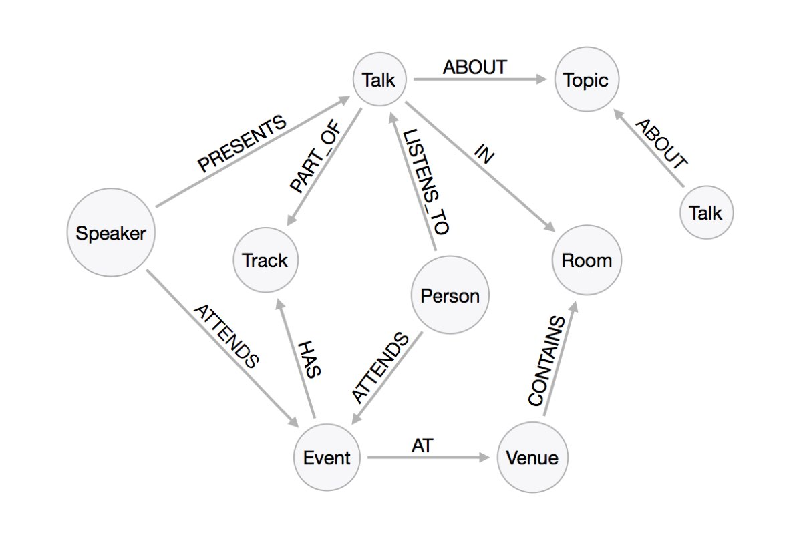
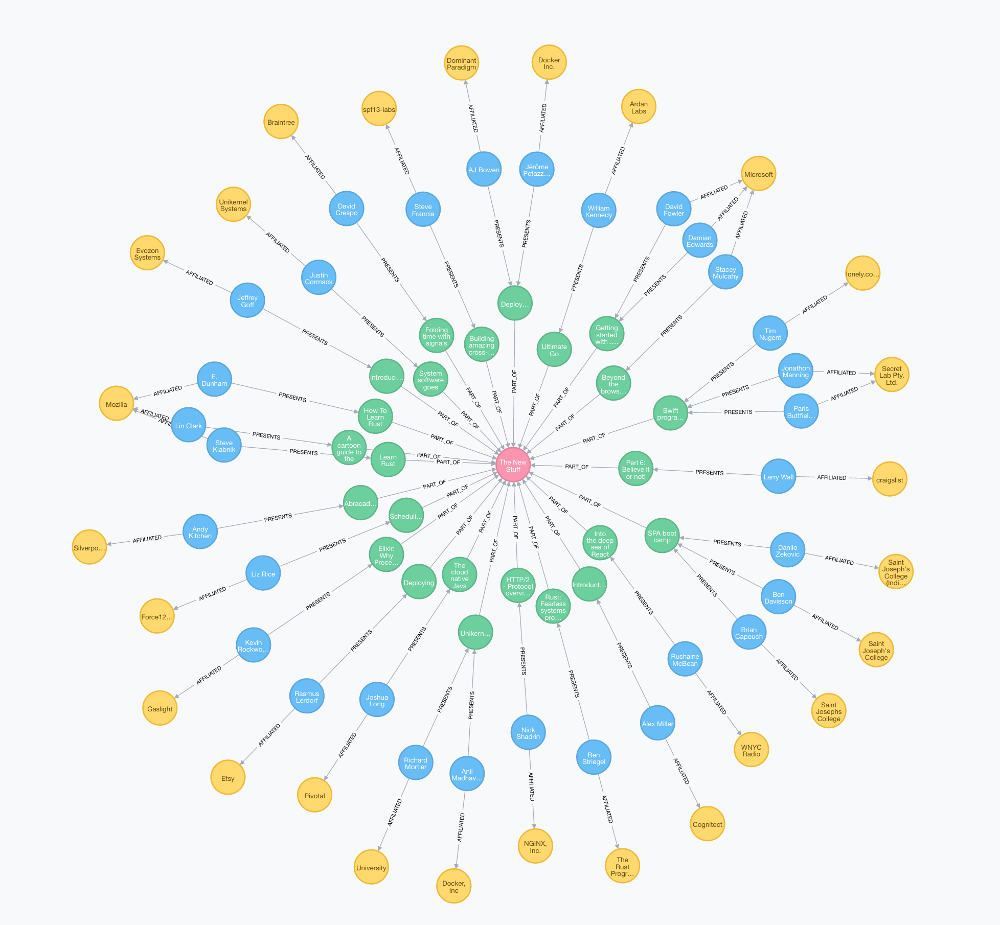

## The OSCON Graph

### The data model

### Querying the graph

There is a read-only instance available [here](http://bit.ly/227xCt5)

#### What are all the talks in "The New Stuff" track? Who are the presenters and who do they work for?

~~~ cypher
MATCH (track:Track {name: "The New Stuff"}) 
MATCH (track)<-[:PART_OF]-(t:Talk)<-[:PRESENTS]-(s:Speaker)
MATCH (s)-[:AFFILIATED]->(org:Organization)
RETURN *
~~~

